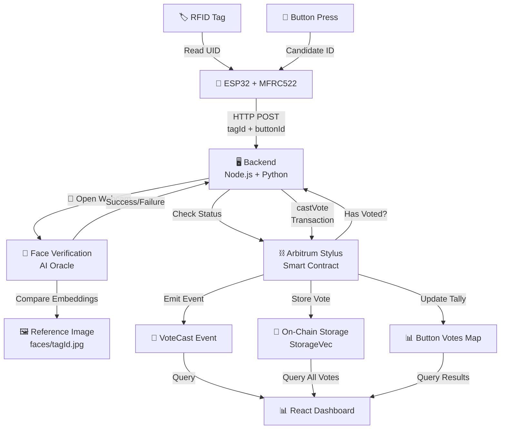
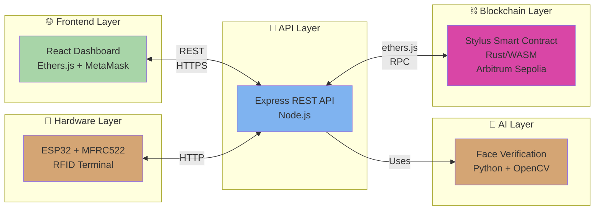
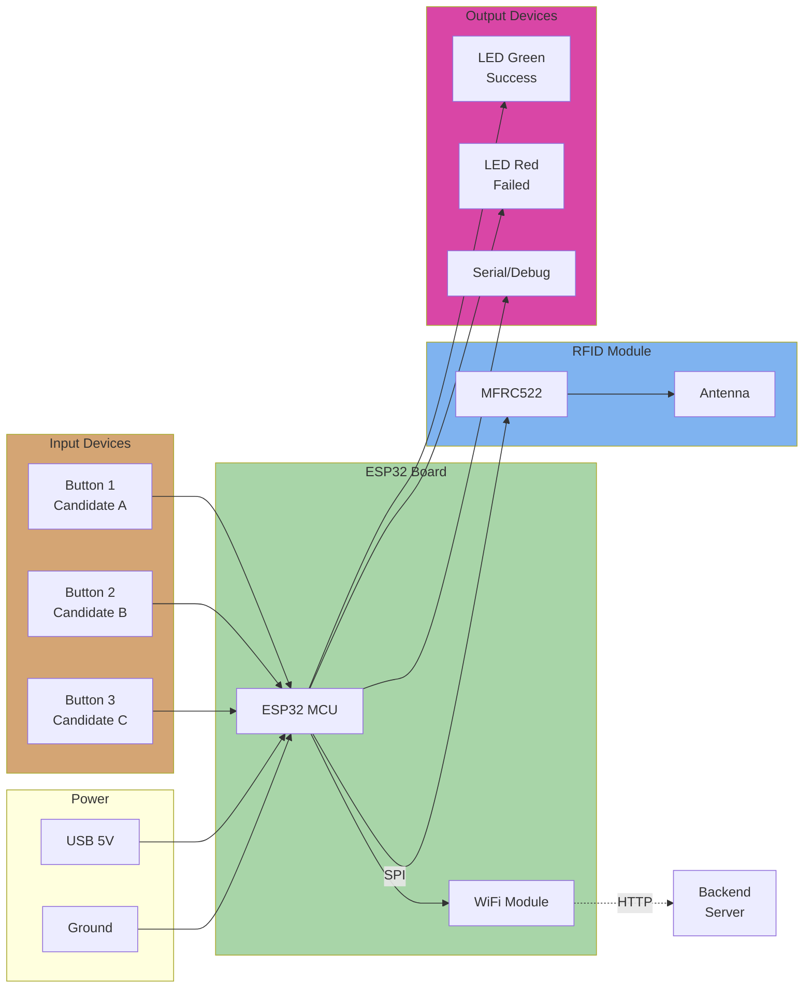

# 🏷️ RFID Voting System with Face Verification
## DePIN + AI + Blockchain on Arbitrum Stylus

A **hardware‑anchored**, **AI‑verified**, fully on‑chain voting system built on **Arbitrum Stylus**.  
RFID tags and ESP32 hardware act as a **physical DePIN layer**, Python‑based face recognition provides **AI‑driven identity assurance**, and a **Rust/WASM smart contract** on Arbitrum records every vote immutably.

> Built for the **Arbitrum Stylus Hackathon** to demonstrate how **real‑world devices**, **biometrics**, and **Layer‑2 WASM contracts** can combine into a secure, high‑throughput on‑chain election stack.

---

## 🔥 What Makes This Project Unique?

### 🌐 **DePIN‑Style Hardware Integration**
The system treats every **ESP32 + MFRC522 RFID terminal** as a **decentralized physical node** in a permissionless voting network. These on‑site devices:
- 📖 Read RFID tags (voter IDs)
- 🔘 Capture button choices (candidates)
- ⛓️ Bridge physical actions into verifiable on‑chain state

### 🧠 **AI + Blockchain Security Loop**
Before a single transaction hits Arbitrum, an **AI‑powered face recognition pipeline** validates that the person behind the RFID tag matches a pre‑registered identity:
- 📸 Python + `face_recognition` + OpenCV compare live webcam frames to stored embeddings
- ✅ Only when AI verification passes does the backend sign and send a `castVote` transaction
- 🔐 The result is a **human‑in‑the‑loop, AI‑gated oracle** for on‑chain voting

### 🦀 **Rust/WASM Smart Contract on Arbitrum Stylus**
Instead of Solidity, the voting logic is implemented in **Rust** and compiled to **WASM** using the Stylus SDK:
- ⚡ Gains **10×+ compute efficiency** and dramatically cheaper memory vs classic EVM
- 🔒 Leverages **Rust's type safety** for complex state and rich error handling
- 🌉 Still exports a **standard EVM‑style ABI** so `ethers.js` can call it like any Solidity contract

### 📊 **End‑to‑End On‑Chain Auditability**
Every successful AI‑verified RFID vote ends up in a **public Stylus contract**, enabling:
- 📈 Transparent recounts
- 🏆 On‑chain winner selection
- 📝 Immutable, queryable history for external indexers or analytics

---

## 📚 Quick Navigation

- [Architecture & Data Flow](#architecture--data-flow)
- [System Components](#system-components)
- [Frontend Interface](#frontend-interface)
- [Hardware Setup](#hardware-setup)
- [Smart Contract](#smart-contract-rust--stylus)
- [Installation & Development](#local-development)
- [Deployment](#deployment)
- [Security](#security-considerations)
- [Future Directions](#future-directions)

---

## 🏗️ Architecture & Data Flow

### System Data Flow



### Component Architecture



---

## 🎯 System Components

### 🖥️ **Backend Server**
- **Tech Stack**: Node.js + Express + ethers.js v6 + Python
- **Responsibilities**:
  - REST API for frontend & ESP32 integration
  - AI-powered face verification orchestration
  - Stylus contract interaction & transaction signing
  - Vote aggregation & historical data queries

### 🧠 **AI Verification Layer**
- **Tech Stack**: Python + face_recognition + OpenCV
- **Process**:
  1. Load reference image from `faces/{tagId}.jpg`
  2. Capture live webcam frames
  3. Compute facial embeddings using deep learning
  4. Compare distances; threshold-based approval
  5. Return verification result to Node.js backend

### ⛓️ **Stylus Smart Contract**
- **Language**: Rust (compiled to WASM)
- **Network**: Arbitrum Sepolia
- **Core Features**:
  - One vote per RFID tag (enforced on-chain)
  - Vote history with timestamps
  - Per-button tallies
  - Winner computation
  - Owner-only admin functions

### 📱 **ESP32 Hardware Terminal**
- **Microcontroller**: ESP32 Dev Board
- **Sensor**: MFRC522 RFID Reader
- **Input**: 3-5 physical buttons (candidates)
- **Output**: LEDs, serial feedback
- **Communication**: WiFi HTTP to backend

### 💻 **React Frontend Dashboard**
- **Features**:
  - Wallet connection (MetaMask)
  - Real-time voting results
  - Vote history table
  - Query tools (tag status, button votes)
  - Admin panel (pick winner, reset votes)
  - Live leader board

---

## 🎨 Frontend Interface

### Dashboard Layout

The React dashboard provides a comprehensive voting interface with real-time updates:

```
┌─────────────────────────────────────────────────────────────┐
│  🏷️  RFID VOTING DAPP | ⚡ Arbitrum Stylus | 🔐 Face Verified │
│                        [🔗 Connect Wallet]                  │
└─────────────────────────────────────────────────────────────┘

┌─────────────────────────────────────────────────────────────┐
│ 🔗 Connected Account: 0x1234...5678                         │
│ 🌐 Network: Arbitrum Sepolia                                │
│ 📄 Contract: 0x16f7...9977                                  │
└─────────────────────────────────────────────────────────────┘

┌─────────────────────────────────────────────────────────────┐
│ 🗳️  CAST YOUR VOTE                                           │
│ ┌──────────────────────────────────────────────────────────┐ │
│ │ RFID Tag ID: [________________]                           │ │
│ │ Button Number: [___]                                     │ │
│ │           [🗳️  CAST VOTE]                                │ │
│ └──────────────────────────────────────────────────────────┘ │
└─────────────────────────────────────────────────────────────┘

┌─────────────────────────────────────────────────────────────┐
│ 📊 VOTING RESULTS                                            │
│ ┌─────────────┐ ┌─────────────┐ ┌─────────────┐           │
│ │  Total Votes│ │Active Buttons│ │ Contract   │           │
│ │     145     │ │       5       │ │ Owner      │           │
│ └─────────────┘ └─────────────┘ └─────────────┘           │
└─────────────────────────────────────────────────────────────┘

┌─────────────────────────────────────────────────────────────┐
│ BUTTON BREAKDOWN                                             │
│ ┌─────────────────────────────────────────────────────────┐ │
│ │ Button 1: 🟩🟩🟩🟩🟩 45 votes (31%)                       │ │
│ │ Button 2: 🟩🟩🟩 38 votes (26%)                         │ │
│ │ Button 3: 🟩🟩🟩🟩 42 votes (29%)                        │ │
│ │ Button 4: 🟩🟩 20 votes (14%)                           │ │
│ └─────────────────────────────────────────────────────────┘ │
└─────────────────────────────────────────────────────────────┘
```

### Key UI Features

| Feature | Description |
|---------|-------------|
| **Wallet Connection** | MetaMask integration for Arbitrum Sepolia |
| **Vote Casting** | Input RFID tag ID + button number with AI verification flow |
| **Results Dashboard** | Real-time vote counts, percentages, and visual progress bars |
| **Vote History** | Full table with tag ID, button, timestamp, and human-readable date |
| **Query Tools** | Check tag voting status, query button vote counts |
| **Admin Panel** | Owner-only functions (pick winner, reset votes, refresh data) |
| **Status Messages** | Color-coded feedback (success 🟢, error 🔴, info 🔵) |

---

## 🔧 Hardware Setup

### Circuit Diagram



### Component Specifications

| Component | Specification | Purpose |
|-----------|---------------|---------|
| **ESP32 Dev Board** | 32-bit, WiFi + BT, 240MHz | Main controller |
| **MFRC522** | 13.56MHz RFID Reader | Voter ID capture |
| **Buttons** | 3-5 momentary switches | Candidate selection |
| **LEDs** | Green + Red | User feedback |
| **USB Power** | 5V, 1A | Power supply |

---

## 📸 Hardware & Working Demo

### Circuit Photos

> **Note**: Add circuit board photos here showing:
> - ESP32 connected to MFRC522 via SPI
> - Buttons wired to GPIO pins
> - LED indicators
> - Power connections

### Working Video

> **[Demo Video Link]** - Shows:
> - 🏷️ RFID tag being read
> - 🧠 Face verification process
> - ✅ Vote successfully cast
> - 📊 Dashboard updating in real-time
> - 🏆 Winner determination

---

## ⛓️ Smart Contract (Rust + Stylus)

### Contract Deployment

**Network**: Arbitrum Sepolia  
**Address**: `0x16f7b54cb4002b5ca98a07ee44d81802e1009977`  
**Language**: Rust (Stylus SDK)

### Storage Structure

```rust
pub struct RFIDVoting {
    owner: Address,                    // Contract owner
    votes: StorageVec<VoteData>,       // All votes history
    has_voted: StorageMap<String, bool>, // One vote per tag
    button_votes: StorageMap<U256, U256>, // Per-button tallies
    locked: bool,                      // Reentrancy guard
}

pub struct VoteData {
    tag_id: StorageString,
    button_number: U256,
    timestamp: U256,
}
```

### Core Functions

```rust
// Initialize contract
pub fn initialize(&mut self) -> Result<(), RFIDVotingError>

// Cast a vote (called by backend after AI verification)
pub fn cast_vote(
    &mut self,
    tag_id: String,
    button_number: U256,
) -> Result<(), RFIDVotingError>

// Get total vote count
pub fn get_vote_count(&self) -> U256

// Get specific vote by index
pub fn get_vote(&self, index: U256) -> Result<(String, U256, U256), RFIDVotingError>

// Determine winner
pub fn pick_winner(&self) -> Result<(U256, U256), RFIDVotingError>

// Reset tag's vote status (owner only)
pub fn reset_vote(&mut self, tag_id: String) -> Result<(), RFIDVotingError>

// Query helper functions
pub fn get_button_votes(&self, button_number: U256) -> U256
pub fn check_has_voted(&self, tag_id: String) -> bool
```

### Events & Errors

**Events**:
- `VoteCast(string tag_id, uint256 button_number, uint256 timestamp)`
- `WinnerDeclared(uint256 winning_button, uint256 votes)`
- `OwnershipTransferred(address indexed previous_owner, address indexed new_owner)`

**Errors**:
- `AlreadyVoted` - Tag has voted before
- `NoVotes` - No votes to process
- `InvalidIndex` - Vote index out of range
- `NotOwner` - Caller is not contract owner
- `ReentrancyGuard` - Reentrancy attempt detected

---

## 🔌 Backend API

### REST Endpoints

| Endpoint | Method | Purpose |
|----------|--------|---------|
| `/health` | GET | Server status check |
| `/initialize` | POST | Initialize contract |
| `/vote` | POST | Cast vote with AI verification |
| `/votes/count` | GET | Total vote count |
| `/votes/all` | GET | Complete vote history |
| `/check/:tagId` | GET | Check if tag has voted |
| `/button/:buttonNumber` | GET | Get button vote count |
| `/winner` | GET | Get current winning button |
| `/reset` | POST | Reset tag vote (owner only) |
| `/owner` | GET | Get contract owner address |

### Request/Response Examples

**Cast Vote**
```json
POST /vote
{
  "tagId": "9158283",
  "buttonId": 2
}

Response:
{
  "success": true,
  "txHash": "0x1234...",
  "message": "Vote cast successfully"
}
```

**Get All Votes**
```json
GET /votes/all

Response:
{
  "success": true,
  "totalVotes": 145,
  "votes": [
    {
      "tagId": "TAG001",
      "buttonNumber": 1,
      "timestamp": 1699564800,
      "date": "2024-11-10 10:30:00"
    },
    ...
  ]
}
```

---

## 📦 Repository Structure

```
Arbitrum-Hackathon/
├── 📁 decentralised_elections/
│   └── decentralised_elections.ino
│
├── 📁 RFID-voting/
│   ├── 📁 rfid-voting-backend/
│   │   ├── index.js                 # Express server
│   │   ├── faceAuth.js              # Python wrapper
│   │   ├── face_verify.py           # AI verification
│   │   ├── abi.json                 # Stylus contract ABI
│   │   ├── faces/                   # Reference images
│   │   ├── package.json
│   │   └── .env.example
│   │
│   └── 📁 rfid-voting-frontend/
│       └── 📁 researchproject/
│           ├── src/
│           │   ├── App.js
│           │   └── App.css
│           ├── public/
│           ├── package.json
│           └── README.md
│
└── 📁 smart-contract/
    ├── src/
    │   └── lib.rs                   # Rust contract source
    ├── Cargo.toml
    └── README.md
```

---

## 🚀 Local Development

### Prerequisites

- **Node.js** 16+ & npm
- **Python** 3.8+ with pip
- **Rust** (stable) with Stylus toolchain
- **Arduino IDE** for ESP32
- **MetaMask** browser extension

### 1️⃣ Smart Contract Setup

```bash
cd smart-contract

# Check the contract compiles
cargo stylus check

# Deploy to Arbitrum Sepolia
cargo stylus deploy \
  --private-key YOUR_PRIVATE_KEY \
  --rpc-url https://arb-sepolia.g.alchemy.com/v2/YOUR_KEY

# Save the deployed address to .env
```

### 2️⃣ Backend Setup

```bash
cd RFID-voting/rfid-voting-backend

# Install dependencies
npm install

# Setup Python environment
python -m venv .venv
source .venv/bin/activate  # or `.venv\Scripts\activate` on Windows
pip install face_recognition opencv-python numpy

# Create environment file
cp .env.example .env

# Edit .env with your values:
# ALCHEMY_RPC_URL=https://arb-sepolia.g.alchemy.com/v2/YOUR_KEY
# PRIVATE_KEY=your_wallet_private_key
# CONTRACT_ADDRESS=0x16f7b54cb4002b5ca98a07ee44d81802e1009977
# PORT=3000

# Start backend
node index.js
```

### 3️⃣ Frontend Setup

```bash
cd RFID-voting/rfid-voting-frontend/researchproject

npm install

# Create environment file (optional)
echo "REACT_APP_BACKEND_URL=http://localhost:3000" > .env

# Start development server
npm start
```

Frontend will open at `http://localhost:3000`

### 4️⃣ ESP32 Arduino Setup

1. Open **Arduino IDE**
2. Install ESP32 board package:
   - Boards Manager → Search "ESP32" → Install
3. Install libraries:
   - Library Manager → Search "MFRC522" → Install
4. Open `decentralised_elections/decentralised_elections.ino`
5. Update WiFi credentials and backend URL
6. Select **ESP32 Dev Module** board
7. Upload sketch

---

## 🌐 Deployment

### Backend Deployment (Railway / Render)

1. Push repository to GitHub
2. Connect to Railway or Render
3. Set root directory: `RFID-voting/rfid-voting-backend`
4. Set start script: `node index.js`
5. Configure environment variables:
   - `ALCHEMY_RPC_URL`
   - `PRIVATE_KEY`
   - `CONTRACT_ADDRESS`
   - `PORT`

### Frontend Deployment (Vercel)

1. Import repository to Vercel
2. Set project root: `RFID-voting/rfid-voting-frontend/researchproject`
3. Add environment variable:
   - `REACT_APP_BACKEND_URL=https://your-backend-url.com`
4. Deploy

### Smart Contract Deployment

```bash
cd smart-contract

cargo stylus deploy \
  --private-key YOUR_PRIVATE_KEY \
  --rpc-url https://arb-sepolia.g.alchemy.com/v2/YOUR_KEY
```

---

## 🔐 Security Considerations

### 🛡️ On-Chain Security

- ✅ **One Vote Per Tag**: Enforced by `has_voted` mapping in Stylus contract
- ✅ **Reentrancy Protection**: Lock mechanism in `cast_vote` function
- ✅ **Owner Validation**: All admin functions check `msg::sender()`
- ✅ **Immutable History**: All votes stored permanently on-chain

### 🔒 Biometric Security

- ✅ **Local Processing**: Face images never leave the local environment
- ✅ **Threshold-Based**: Facial distance comparison with tuned threshold
- ✅ **Reference Storage**: Pre-registered faces stored locally, not on-chain

### 🔑 Private Key Management

- ✅ **Environment Variables**: Private keys in `.env` (never committed)
- ✅ **Server-Side Signing**: Only backend signs transactions
- ✅ **RPC Integration**: Uses Alchemy or similar trusted RPC

### ⚠️ Limitations

This is a **research/hackathon prototype**, not production-grade voting infrastructure:
- Biometric verification threshold needs tuning for your environment
- Hardware security depends on physical terminal setup
- No formal security audit completed

---

## 🚀 Future Directions

### 🔮 Advanced Features

- **ZK Proofs**: On-chain verification of face embedding proofs using Stylus WASM
- **Multi-Election Support**: Parameterized elections with separate candidate sets
- **On-Chain Analytics**: Heavy computation for turnout analysis and anomaly detection
- **DAO Integration**: Connect to Arbitrum governance systems
- **Hardware Attestation**: Secure enclave support for ESP32-class hardware

### 💡 Research Opportunities

- Decentralized DePIN networks with incentive mechanisms
- Federated learning for biometric models
- Cross-chain vote aggregation
- Scalability improvements using Arbitrum's latest features

---

## 📄 License

MIT License – See `LICENSE` file for details.

---

## 🙏 Acknowledgments

Built with 🦀 **Rust** | ⚡ **Arbitrum Stylus** | 🧠 **AI/ML** | 📡 **IoT Hardware** | ❤️ **for the Arbitrum Stylus Hackathon**

---

## 📞 Support & Resources

- **Arbitrum Stylus Docs**: https://docs.arbitrum.io/stylus/
- **Stylus SDK**: https://github.com/OffchainLabs/stylus-sdk-rs
- **ethers.js**: https://docs.ethers.org/v6/
- **MFRC522 Library**: https://github.com/miguelbalboa/rfid

---

**Questions?** Open an issue or reach out to the team! 🚀
