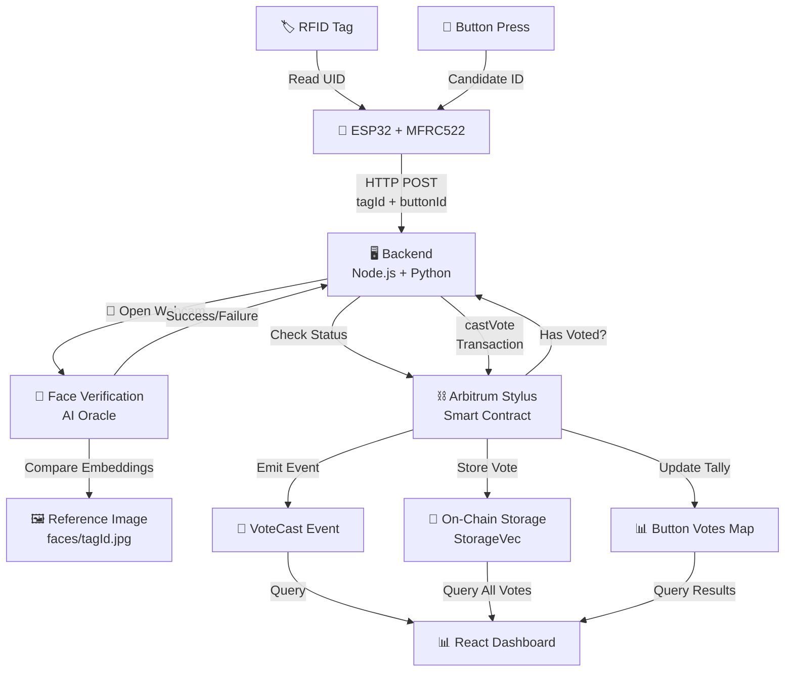
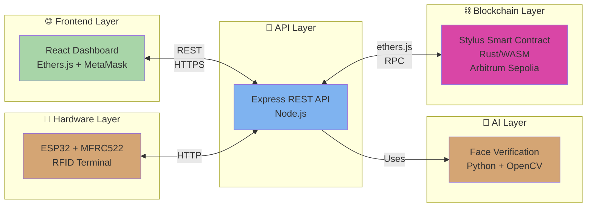
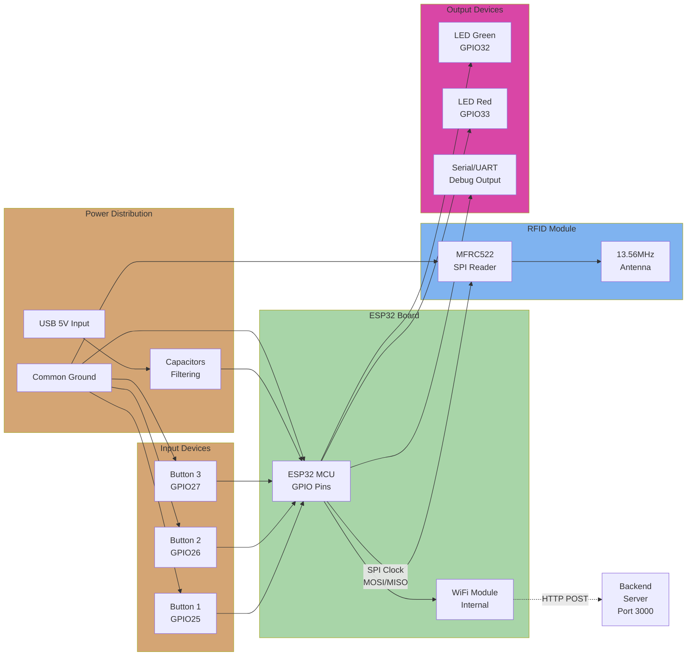

# 🏷️ RFID Voting System with Face Verification
## DePIN + AI + Blockchain on Arbitrum Stylus

A **hardware‑anchored**, **AI‑verified**, fully on‑chain voting system built on **Arbitrum Stylus**.  
RFID tags and ESP32 hardware act as a **physical DePIN layer**, Python‑based face recognition provides **AI‑driven identity assurance**, and a **Rust/WASM smart contract** on Arbitrum records every vote immutably.

> Built for the **Arbitrum Stylus Hackathon** to demonstrate how **real‑world devices**, **biometrics**, and **Layer‑2 WASM contracts** can combine into a secure, high‑throughput on‑chain election stack.

### 🌐 **Live Demo**
- **Frontend Interface**: https://arbitrum-hackathon.vercel.app/ 
  > ⚠️ **Note**: Deployed frontend is for UI/UX demonstration only. Backend services (face verification, blockchain signing) require local deployment with hardware access and private keys. See [Local Development](#local-development) for full setup.

---

## 🔥 What Makes This Project Unique?

### 🌐 **DePIN‑Style Hardware Integration**
The system treats every **ESP32 + MFRC522 RFID terminal** as a **decentralized physical node** in a permissionless voting network. These on‑site devices:
- 📖 Read RFID tags (voter IDs)
- 🔘 Capture button choices (candidates)
- ⛓️ Bridge physical actions into verifiable on‑chain state

### 🧠 **AI + Blockchain Security Loop**
Before a single transaction hits Arbitrum, an **AI‑powered face recognition pipeline** validates that the person behind the RFID tag matches a pre‑registered identity:
- 📸 Python + `face_recognition` + OpenCV compare live webcam frames to stored embeddings
- ✅ Only when AI verification passes does the backend sign and send a `castVote` transaction
- 🔐 The result is a **human‑in‑the‑loop, AI‑gated oracle** for on‑chain voting

### 🦀 **Rust/WASM Smart Contract on Arbitrum Stylus**
Instead of Solidity, the voting logic is implemented in **Rust** and compiled to **WASM** using the Stylus SDK:
- ⚡ Gains **10×+ compute efficiency** and dramatically cheaper memory vs classic EVM
- 🔒 Leverages **Rust's type safety** for complex state and rich error handling
- 🌉 Still exports a **standard EVM‑style ABI** so `ethers.js` can call it like any Solidity contract

### 📊 **End‑to‑End On‑Chain Auditability**
Every successful AI‑verified RFID vote ends up in a **public Stylus contract**, enabling:
- 📈 Transparent recounts
- 🏆 On‑chain winner selection
- 📝 Immutable, queryable history for external indexers or analytics

---

## 📚 Quick Navigation

- [System Overview](#system-overview)
- [Architecture & Data Flow](#-architecture--data-flow)
- [How It Works](#-how-it-works)
- [System Components](#-system-components)
- [Frontend Interface](#-frontend-interface)
- [Hardware Setup](#-hardware-setup)
- [Smart Contract](#-smart-contract-rust--stylus)
- [Backend API](#-backend-api)
- [Installation & Development](#-local-development)
- [Deployment](#-deployment)
- [Security](#-security-considerations)
- [Future Directions](#-future-directions)

---

## 🎯 System Overview

### End-to-End Flow

```
Physical Voter
      │
      ├─→ 🏷️ RFID Card/Keyfob (Voter ID)
      └─→ 🔘 Button Press (Candidate Choice)
           │
           ▼
    📱 ESP32 Terminal (DePIN Node)
           │
           ├─→ Read RFID UID
           ├─→ Detect Button Press
           └─→ Send HTTP to Backend
                │
                ▼
    🖥️ Backend Server (Node.js)
           │
           ├─→ Check "Has Voted" on Contract
           ├─→ Launch Face Verification
           │   ├─→ 📸 Capture Webcam Frames
           │   ├─→ 🧠 Compare Face Embeddings
           │   └─→ ✅ Verify Human Identity
           │
           └─→ If All Pass → Sign & Send Vote
                │
                ▼
    ⛓️ Arbitrum Stylus Contract (Rust)
           │
           ├─→ Verify One Vote Per Tag
           ├─→ Record Vote Immutably
           ├─→ Update Button Tally
           ├─→ Emit Event
           └─→ Store on L2
                │
                ▼
    📊 React Dashboard
           │
           ├─→ Query Vote History
           ├─→ Display Live Results
           ├─→ Show Winner
           └─→ Admin Controls
```

---

## 🏗️ Architecture & Data Flow

### System Data Flow



### Component Architecture



---

## 🔄 How It Works

### Step 1: Hardware Input (Physical DePIN Layer)

1. **RFID Reader** scans voter's tag/card
   - MFRC522 reads the unique ID (e.g., `9158283`)
   - Sent to ESP32 via SPI protocol

2. **Button Press** registers candidate choice
   - Voter selects a button (1-5)
   - ESP32 detects GPIO signal

3. **Data Transmission**
   - ESP32 makes HTTP POST request to backend
   - Payload: `{ tagId: "9158283", buttonId: 2 }`

### Step 2: Backend Verification (AI Oracle Layer)

1. **Status Check**
   - Backend queries Stylus contract: "Has `9158283` voted before?"
   - If yes → Reject (vote recorded)
   - If no → Continue

2. **Face Verification Pipeline**
   - Python script launches with the tag ID
   - Loads reference photo: `faces/9158283.jpg`
   - Opens webcam on local machine
   - Captures 10-20 frames in real-time
   - For each frame:
     - Extract facial embedding (128-dimensional vector)
     - Compare distance to reference embedding
     - If distance < threshold (0.6) → **Verified** ✅

3. **AI Result**
   - If verification succeeds: proceed to vote
   - If fails: return error to user

### Step 3: On-Chain Vote Recording (Blockchain Layer)

1. **Transaction Signing**
   - Backend signs vote transaction with server wallet
   - Gas will be paid by the backend's account

2. **Smart Contract Execution**
   ```
   castVote(tag_id="9158283", button_number=2)
   ├─→ Check has_voted["9158283"] == false (reentrancy guard)
   ├─→ Append to votes[]: (tag_id, button_number, timestamp)
   ├─→ Set has_voted["9158283"] = true
   ├─→ Increment button_votes[2] += 1
   ├─→ Emit VoteCast event
   └─→ Transaction confirmed on Arbitrum Sepolia
   ```

3. **Vote Immutability**
   - Vote now lives on-chain forever
   - Can be queried by contract or external indexers
   - Cannot be modified or deleted

### Step 4: Dashboard Update (Frontend Layer)

1. **Real-Time Queries**
   - Frontend polls backend for updated vote counts
   - Fetches full vote history with timestamps

2. **Display**
   - Total votes: +1
   - Button 2 tally: +1
   - Vote history table: new row with voter info

3. **Winner Computation**
   - Contract's `pickWinner()` function determines leading button
   - Dashboard displays current leader

---

## 🎯 System Components

### 🖥️ **Backend Server**
- **Tech Stack**: Node.js + Express + ethers.js v6 + Python
- **Responsibilities**:
  - REST API for frontend & ESP32 integration
  - AI-powered face verification orchestration
  - Stylus contract interaction & transaction signing
  - Vote aggregation & historical data queries
- **Key File**: `RFID-voting/rfid-voting-backend/index.js`

### 🧠 **AI Verification Layer**
- **Tech Stack**: Python + face_recognition + OpenCV
- **Process**:
  1. Load reference image from `faces/{tagId}.jpg`
  2. Capture live webcam frames (500ms intervals)
  3. Compute facial embeddings using deep learning (dlib CNN)
  4. Compare distances; threshold-based approval (~0.6)
  5. Return verification result to Node.js backend
- **Key File**: `RFID-voting/rfid-voting-backend/face_verify.py`

### ⛓️ **Stylus Smart Contract**
- **Language**: Rust (compiled to WASM)
- **Network**: Arbitrum Sepolia (Chain ID: 421614)
- **Contract Address**: `0x16f7b54cb4002b5ca98a07ee44d81802e1009977`
- **Core Features**:
  - One vote per RFID tag (enforced on-chain)
  - Vote history with timestamps
  - Per-button tallies
  - Winner computation
  - Owner-only admin functions
- **Key File**: `smart-contract/src/lib.rs`

### 📱 **ESP32 Hardware Terminal**
- **Microcontroller**: ESP32 Dev Board (32-bit, 240MHz, WiFi)
- **Sensor**: MFRC522 RFID Reader (13.56MHz)
- **Input**: 3-5 physical buttons (candidates)
- **Output**: LEDs (green/red), serial feedback
- **Communication**: WiFi HTTP to backend
- **Key File**: `decentralised_elections/decentralised_elections.ino`

### 💻 **React Frontend Dashboard**
- **Features**:
  - Wallet connection (MetaMask on Arbitrum Sepolia)
  - Real-time voting results with live updates
  - Vote history table with full audit trail
  - Query tools (tag status, button votes)
  - Admin panel (pick winner, reset votes, refresh)
  - Retro arcade-style UI with smooth animations
- **Key Files**: `RFID-voting/rfid-voting-frontend/researchproject/src/App.js` + `App.css`

---

## 🎨 Frontend Interface

### Live Demo
🌐 **Deployed Frontend**: https://arbitrum-hackathon.vercel.app/

> ⚠️ **Important**: This is a UI showcase only. The deployed version shows the interface but cannot cast votes because:
> - No backend server running (face verification unavailable)
> - No private keys configured (cannot sign transactions)
> - No hardware connection (ESP32 not connected)
> 
> For full functionality, follow [Local Development](#local-development) to run everything locally.

### Dashboard Screenshots

#### 1. Main Interface & Wallet Connection


*The main dashboard showing wallet connection status, voting interface, and real-time results*

#### 2. Vote Results & Statistics


*Live voting statistics with button breakdown, vote counts, and percentage distribution*

#### 3. Vote History Table


*Complete audit trail showing all votes with tag IDs, buttons pressed, and timestamps*

#### 4. Admin Controls & Winner Selection


*Owner-only functions for picking winner, resetting votes, and managing the election*

### Key UI Features

| Feature | Description |
|---------|-------------|
| **Wallet Connection** | MetaMask integration for Arbitrum Sepolia (Chain ID: 421614) |
| **Vote Casting** | Input RFID tag ID + button number with AI verification flow |
| **Results Dashboard** | Real-time vote counts, percentages, and visual progress bars |
| **Vote History** | Full table with tag ID, button, timestamp, and human-readable date |
| **Query Tools** | Check tag voting status, query button vote counts |
| **Admin Panel** | Owner-only functions (pick winner, reset votes, refresh data) |
| **Status Messages** | Color-coded feedback (success 🟢, error 🔴, info 🔵) |
| **Retro Design** | Arcade-style UI with smooth animations and engaging interactions |

---

## 🔧 Hardware Setup

### Physical Circuit


*ESP32 board connected to MFRC522 RFID reader, buttons, LEDs, and power supply*

### Circuit Architecture Diagram


*Detailed schematic showing all connections and signal flows*

### Circuit Diagram (Technical)



### Component Specifications

| Component | Specification | Pin | Purpose |
|-----------|---------------|-----|---------|
| **ESP32 Dev Board** | 32-bit, WiFi + BT, 240MHz | — | Main controller |
| **MFRC522** | 13.56MHz RFID Reader | SPI | Voter ID capture |
| **Buttons** | 3-5 momentary switches | GPIO 25-27 | Candidate selection |
| **LED Green** | 3mm, 20mA | GPIO 32 | Vote success feedback |
| **LED Red** | 3mm, 20mA | GPIO 33 | Vote failure feedback |
| **USB Power** | 5V, 1A | Micro USB | Power supply |

### SPI Connection Details

```
ESP32 to MFRC522 (SPI Protocol)
├─ ESP32 GPIO 18 (SCLK) ← MFRC522 SCK
├─ ESP32 GPIO 23 (MOSI) → MFRC522 SDA/MOSI
├─ ESP32 GPIO 19 (MISO) ← MFRC522 MISO
├─ ESP32 GPIO 5 (CS)   → MFRC522 SDA
└─ ESP32 GND ←→ MFRC522 GND
```

---

## 🎥 Working Demo Video

https://github.com/user-attachments/assets/b52208f3-8c27-4b83-9381-3e800eaa850b

**Demo Shows:**
- 🏷️ RFID tag being read by MFRC522 reader
- 🧠 Face verification process opening and verifying
- ✅ Vote successfully cast to blockchain
- 📊 Dashboard updating in real-time with new vote
- 🏆 Winner determination and result display
- 🔄 Full cycle from physical input to on-chain record

---

## ⛓️ Smart Contract (Rust + Stylus)

### Contract Deployment

| Property | Value |
|----------|-------|
| **Network** | Arbitrum Sepolia (Chain ID: 421614) |
| **Address** | `0x16f7b54cb4002b5ca98a07ee44d81802e1009977` |
| **Language** | Rust (Stylus SDK) |
| **Compiled To** | WebAssembly (WASM) |
| **Status** | ✅ Live & Functional |

### Storage Structure

```rust
pub struct RFIDVoting {
    // Contract administrator
    owner: Address,
    
    // Complete vote history - immutable audit trail
    votes: StorageVec<VoteData>,
    
    // Prevents double voting per RFID tag
    has_voted: StorageMap<String, bool>,
    
    // Live tally for each candidate button
    button_votes: StorageMap<U256, U256>,
    
    // Reentrancy protection for vote casting
    locked: bool,
}

pub struct VoteData {
    tag_id: StorageString,           // Voter's RFID tag
    button_number: U256,             // Which candidate was chosen
    timestamp: U256,                 // When vote was cast (Unix time)
}
```

### Core Functions

```rust
// Initialize contract (called once after deployment)
pub fn initialize(&mut self) -> Result<(), RFIDVotingError>
// Sets owner to msg::sender(), unlocks contract

// Main voting function (called by backend after AI verification)
pub fn cast_vote(
    &mut self,
    tag_id: String,
    button_number: U256,
) -> Result<(), RFIDVotingError>
// Enforces: one vote per tag, records immutably, updates tallies

// Query total votes cast
pub fn get_vote_count(&self) -> U256
// Returns: total number of votes in votes vector

// Retrieve specific vote by index
pub fn get_vote(&self, index: U256) -> Result<(String, U256, U256), RFIDVotingError>
// Returns: (tag_id, button_number, timestamp)

// Determine current winning button
pub fn pick_winner(&self) -> Result<(U256, U256), RFIDVotingError>
// Returns: (winning_button_number, vote_count)

// Reset a tag's vote status (owner only)
pub fn reset_vote(&mut self, tag_id: String) -> Result<(), RFIDVotingError>
// Sets has_voted[tag_id] = false, allows re-voting

// Owner query
pub fn owner(&self) -> Address
// Returns current contract owner

// Transfer ownership (owner only)
pub fn transfer_ownership(&mut self, new_owner: Address) -> Result<(), RFIDVotingError>
// Updates owner, emits OwnershipTransferred event

// Query per-button tally
pub fn get_button_votes(&self, button_number: U256) -> U256
// Returns vote count for specific button

// Check if tag has voted
pub fn check_has_voted(&self, tag_id: String) -> bool
// Returns true if tag already voted, false otherwise
```

### Events & Errors

**Events** (indexed for off-chain monitoring):
```rust
VoteCast(string tag_id, uint256 button_number, uint256 timestamp)
  ├─ Emitted when vote is successfully recorded
  ├─ Used for real-time dashboard updates
  └─ Indexed in blockchain explorers

WinnerDeclared(uint256 winning_button, uint256 votes)
  └─ Emitted when pick_winner() determines a winner

OwnershipTransferred(address indexed previous_owner, address indexed new_owner)
  └─ Emitted when contract owner changes
```

**Errors** (with descriptive messages):
```rust
AlreadyVoted(string message)
  └─ Thrown when tag attempts to vote twice

NoVotes(string message)
  └─ Thrown when pick_winner() called with zero votes

InvalidIndex(string message)
  └─ Thrown when get_vote() index out of bounds

NotOwner(string message)
  └─ Thrown when non-owner calls admin functions

ReentrancyGuard(string message)
  └─ Thrown when reentrancy attempt detected
```

### Rust/WASM Advantages

| Advantage | Impact |
|-----------|--------|
| **10× Compute Efficiency** | Faster vote processing, cheaper gas |
| **100-500× Memory Savings** | Can store larger vote histories |
| **Type Safety** | Rust compiler prevents entire classes of bugs |
| **EVM Compatible ABI** | Works seamlessly with ethers.js and MetaMask |
| **WASM Execution** | Enables future complex on-chain logic (ZK, analytics) |

---

## 🔌 Backend API

### Server Setup

```bash
# Backend runs on http://localhost:3000 by default
# All endpoints expect JSON requests/responses
# CORS enabled for frontend communication
```

### REST Endpoints

| Endpoint | Method | Auth | Purpose | Response |
|----------|--------|------|---------|----------|
| `/health` | GET | ❌ | Server status check | `{ "status": "ok" }` |
| `/initialize` | POST | ❌ | Initialize contract | `{ "success": true, "txHash": "0x..." }` |
| `/vote` | POST | ❌ | Cast vote with AI verification | `{ "success": true, "txHash": "0x..." }` |
| `/votes/count` | GET | ❌ | Total vote count | `{ "totalVotes": 145 }` |
| `/votes/all` | GET | ❌ | Complete vote history | `{ "votes": [...], "totalVotes": 145 }` |
| `/check/:tagId` | GET | ❌ | Check if tag has voted | `{ "hasVoted": true/false }` |
| `/button/:buttonNumber` | GET | ❌ | Get button vote count | `{ "votes": 45 }` |
| `/winner` | GET | ❌ | Get current winner | `{ "buttonNumber": 2, "votes": 50 }` |
| `/reset` | POST | 🔐 | Reset tag vote (owner only) | `{ "success": true }` |
| `/owner` | GET | ❌ | Get contract owner | `{ "owner": "0x..." }` |

### Request/Response Examples

#### Cast Vote with Face Verification
```json
POST /vote
Content-Type: application/json

{
  "tagId": "9158283",
  "buttonId": 2
}

Response (Success):
{
  "success": true,
  "txHash": "0x1a2b3c4d5e6f7g8h9i0j...",
  "message": "Vote cast successfully!",
  "blockNumber": 12345678
}

Response (Face Verification Failed):
{
  "success": false,
  "error": "Face verification failed! Make sure your face image exists in backend/faces/ folder",
  "message": "Biometric authentication did not pass"
}

Response (Already Voted):
{
  "success": false,
  "error": "This tag has already voted!",
  "message": "One vote per RFID tag allowed"
}
```

#### Get All Votes
```json
GET /votes/all

Response:
{
  "success": true,
  "totalVotes": 145,
  "votes": [
    {
      "tagId": "9158283",
      "buttonNumber": 2,
      "timestamp": 1699564800,
      "date": "2024-11-10 10:30:00"
    },
    {
      "tagId": "AC6955D3",
      "buttonNumber": 1,
      "timestamp": 1699564920,
      "date": "2024-11-10 10:32:00"
    }
  ]
}
```

#### Check Tag Status
```json
GET /check/9158283

Response (Has Voted):
{
  "success": true,
  "tagId": "9158283",
  "hasVoted": true,
  "message": "Tag has already voted"
}

Response (Not Voted):
{
  "success": true,
  "tagId": "9158283",
  "hasVoted": false,
  "message": "Tag is eligible to vote"
}
```

#### Get Current Winner
```json
GET /winner

Response:
{
  "success": true,
  "winner": {
    "buttonNumber": 1,
    "votes": 52,
    "percentage": 35.9
  },
  "totalVotes": 145
}
```

### Error Handling

All endpoints return consistent error format:

```json
{
  "success": false,
  "error": "Error type or code",
  "message": "Human-readable error description",
  "statusCode": 400
}
```

---

## 📦 Repository Structure

```
Arbitrum-Hackathon/
│
├── 📁 decentralised_elections/
│   └── decentralised_elections.ino          # ESP32 Arduino sketch
│       ├── RFID reader initialization
│       ├── Button input handling
│       ├── WiFi HTTP communication
│       └── LED feedback system
│
├── 📁 RFID-voting/
│   │
│   ├── 📁 rfid-voting-backend/
│   │   ├── index.js                         # Express server + ethers integration
│   │   │   ├── REST endpoint definitions
│   │   │   ├── Contract interaction
│   │   │   └── Request validation
│   │   │
│   │   ├── faceAuth.js                      # Python face verification wrapper
│   │   │   ├── Spawns Python subprocess
│   │   │   ├── Handles camera access
│   │   │   └── Returns verification result
│   │   │
│   │   ├── face_verify.py                   # AI verification core
│   │   │   ├── Face embedding computation
│   │   │   ├── Distance comparison logic
│   │   │   └── Threshold-based approval
│   │   │
│   │   ├── abi.json                         # Stylus contract ABI
│   │   ├── package.json                     # Node dependencies
│   │   ├── .env.example                     # Configuration template
│   │   └── faces/                           # Reference images directory
│   │       ├── 9158283.jpg                  # Reference face for tag
│   │       ├── AC6955D3.jpg
│   │       └── .gitkeep
│   │
│   └── 📁 rfid-voting-frontend/
│       └── 📁 researchproject/
│           ├── src/
│           │   ├── App.js                   # Main React component
│           │   │   ├── Wallet connection
│           │   │   ├── Vote casting
│           │   │   ├── Results display
│           │   │   └── Admin controls
│           │   │
│           │   └── App.css                  # Retro arcade styling
│           │       ├── Dark theme
│           │       ├── Smooth animations
│           │       └── Responsive design
│           │
│           ├── public/
│           ├── package.json
│           └── README.md
│
└── 📁 smart-contract/
    ├── src/
    │   └── lib.rs                           # Rust Stylus contract source
    │       ├── Storage structures
    │       ├── Vote casting logic
    │       ├── Winner computation
    │       ├── Admin functions
    │       └── Events & errors
    │
    ├── Cargo.toml                           # Rust dependencies
    └── README.md                            # Contract documentation
```

---

## 🚀 Local Development

### Prerequisites Checklist

- ✅ **Node.js** 16+ & npm
- ✅ **Python** 3.
